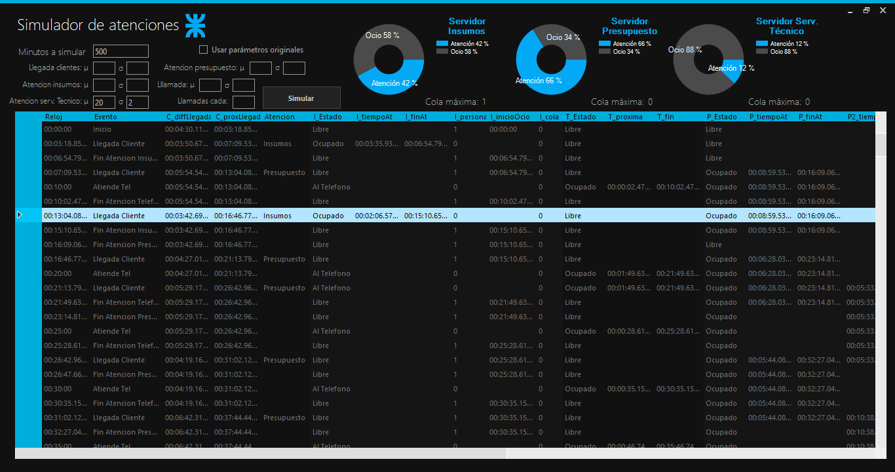

# simulacion-utn
Simulador de tiempos de atención a un local de computación, utilizando diferentes distribuciones de probabilidad para simular la llegada de clientes, los tiempos de atención, y las colas generadas . Trabajo final de la materia Simulación de la UTN-FRC , este simulador resuelve el problema planteado en el ejercicio Nº40. 

  

Componentes de UI : https://github.com/thielj/MetroFramework/
